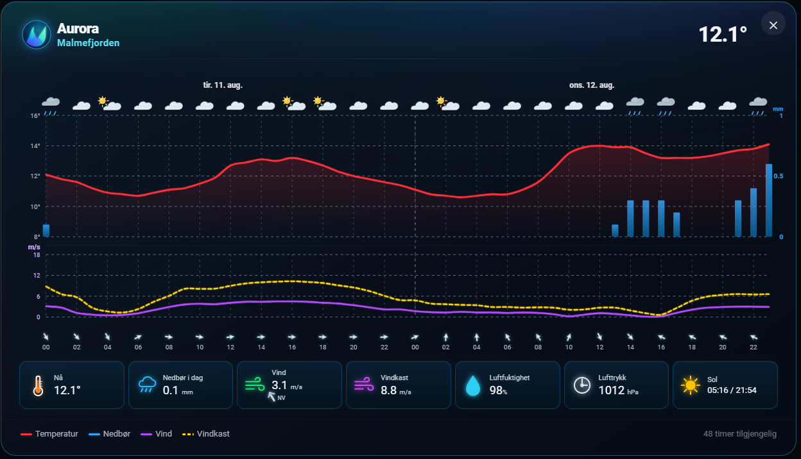
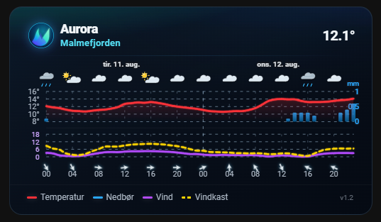
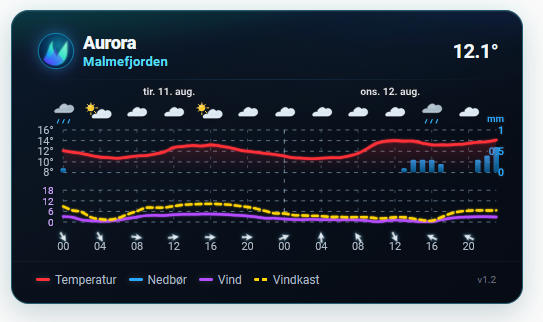
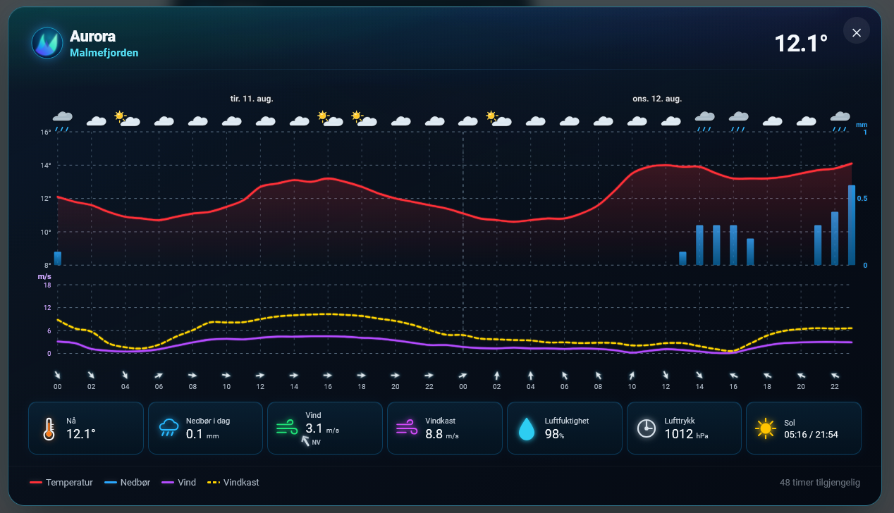

# Aurora Weather Card

A premium weather card for Home Assistant.

Aurora Weather Card combines modern weather visualization with a calm Scandinavian-inspired design.

> **Information first. Atmosphere second.**

## Screenshots

### Expanded 48-hour view



### Compact view



### Light mode





## Features

- Temperature forecast graph
- Precipitation graph with dynamic scale
- Wind and wind-gust graphs
- Wind direction indicators
- Wind values displayed in m/s
- Hourly weather icons
- 24 / 48 hour forecast
- Responsive desktop, tablet and mobile layout
- Expandable detailed 48-hour view
- Weather information tiles in expanded view
- Visual configuration editor
- Six independent GRAPH switches, with matching legend visibility
- Place-name search, local time-zone selection and manual location fallback
- Aurora Static
- Aurora Dynamic Atmosphere
- Day atmosphere
- Animated Northern Lights night atmosphere
- Seasonal atmosphere support

## Weather data

Aurora Weather Card currently uses a Home Assistant `weather.*` entity as its data source.

MET Norway / Met.no is recommended, but another compatible Home Assistant weather entity can be used.

## Installation

### HACS

Install **Aurora Weather Card** through HACS.

The card uses:

`aurora-weather-card.js`

After installation, reload Home Assistant if necessary.

### Manual installation

Copy:

`dist/aurora-weather-card.js`

to:

`/config/www/aurora-weather-card/aurora-weather-card.js`

Add the Lovelace resource:

`/local/aurora-weather-card/aurora-weather-card.js`

Resource type:

`JavaScript module`

Reload the browser resources or restart Home Assistant if necessary.

## Example

```yaml
type: custom:aurora-weather-card
entity: weather.home
location_name: Home
hours: 48
theme: aurora_dynamic
```

## Configuration

| Option | Description |
| --- | --- |
| `entity` | Home Assistant `weather.*` entity |
| `location_name` | Custom location name shown in the card |
| `hours` | Forecast period, 24 or 48 hours |
| `theme` | Aurora theme/background selection |
| `show_temperature` | Show temperature graph and legend; default `true` |
| `show_precipitation` | Show precipitation bars and legend; default `true` |
| `show_wind` | Show wind graph and legend; default `true` |
| `show_wind_gust` | Show wind-gust graph and legend; default `true` |
| `show_wind_direction` | Show wind-direction arrows; default `true` |
| `show_weather_icons` | Show forecast weather icons; default `true` |
| `latitude`, `longitude` | Optional coordinates for local solar calculations |
| `time_zone` | Optional IANA time zone, for example `Europe/Oslo` |

The GRAPH options apply to compact and expanded views. Existing configurations keep all graph elements enabled.

CONFIG can search for a place name through Open-Meteo geocoding and save the selected coordinates and time zone. ADVANCED provides manual fallback fields. The forecast still comes from the selected `weather.*` entity: changing the display location does not relocate that entity's forecast.

### Upgrading to v1.3.0

Update through HACS and reload your browser. Existing dashboards keep `type: custom:aurora-weather-card`.

For manual installations, replace the resource file and append `?v=1.3.0` to its URL. Development-build users should change `custom:aurora-weather-card-dev` to `custom:aurora-weather-card` when switching to the stable resource.

## Visual editor

Aurora Weather Card includes a visual configuration editor for Home Assistant.


## What's new in v1.3.0

Six graph visibility switches, matching legends, a tabbed editor and location search with local time and solar calculations. The release is based on the tested v1.3-dev Step 9B build.

## Previous update: v1.2

Version 1.2 brings the completed Aurora Dynamic Atmosphere together with a refined compact and expanded weather experience.

- Refined compact card layout
- Expanded 48-hour forecast
- Improved graph spacing and scales
- Dynamic precipitation scaling
- Wind direction indicators
- Expanded-view weather information tiles
- Code-based SVG metric icons
- Aurora Dynamic Atmosphere
- Animated Northern Lights night mode
- Day atmosphere
- Seasonal atmosphere support
- Responsive refinements for desktop, tablet and mobile

## Compatibility

Designed and tested with:

- Home Assistant 2026.8+
- Sections Dashboard
- Masonry Dashboard
- Light Theme
- Dark Theme
- Desktop
- Tablet
- Mobile

## Design Philosophy

Aurora Weather Card was created around one simple idea:

> **Information first. Atmosphere second.**

The weather should always be easy to read.

Visual effects should support the information, never compete with it.

## Credits

Created by **Arne Aleksandersen**.

Designed and developed in collaboration with OpenAI ChatGPT through extensive real-world testing in Home Assistant.

## License

MIT License
