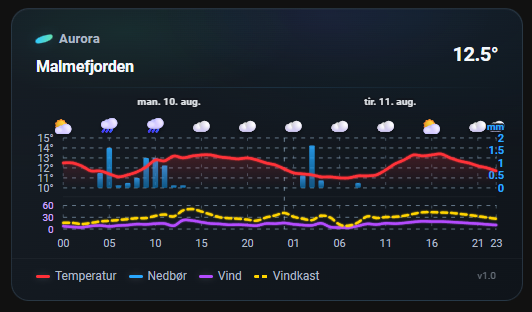
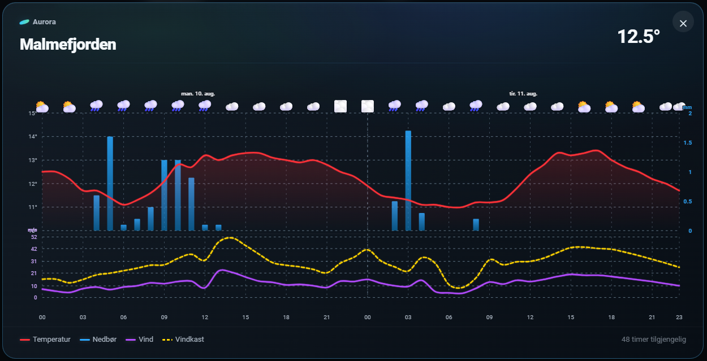
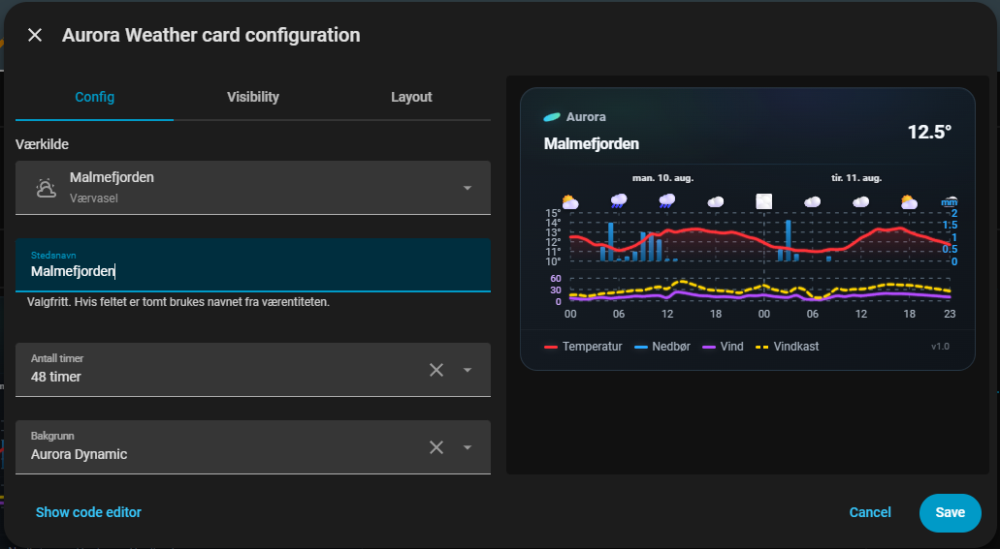
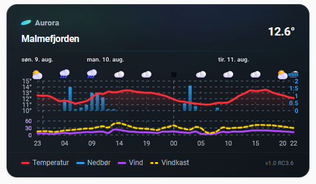

# Aurora Weather Card

A premium weather card for Home Assistant.

Aurora Weather Card combines modern weather visualization with a calm Scandinavian-inspired design.

> **Information first. Atmosphere second.**

---

# Preview



---

# Features

- 🌡️ Temperature forecast graph
- 🌧️ Precipitation graph
- 💨 Wind graph
- 🌬️ Wind gust graph
- ☁️ Hourly weather icons
- 📈 24 / 48 / 72 hour forecast
- 📱 Responsive layout
- 🌙 Light & Dark Mode
- 🔍 Expandable detailed view
- ⚙️ Visual configuration editor
- 🎨 Aurora Static
- ✨ Aurora Dynamic foundation

---

# Screenshots

## Normal View


---

## Expanded View



---

## Visual Configuration Editor



---

## Light Mode



---

# Installation

Copy the JavaScript file to:

```text
/config/www/aurora-weather-card/
```

Add the resource:

```text
/local/aurora-weather-card/aurora-weather-card.js
```

Resource Type:

```text
JavaScript Module
```

Restart Home Assistant (or reload browser resources).

---

# Example

```yaml
type: custom:aurora-weather-card
entity: weather.home
```

---

# Configuration

| Option | Description |
|---------|-------------|
| Entity | Weather entity |
| Location Name | Custom location name |
| Forecast Hours | 24 / 48 / 72 |
| Background | Aurora Static / Aurora Dynamic |

---

# Design Philosophy

Aurora Weather Card was created around one simple idea:

> **Information first. Atmosphere second.**

The weather should always be easy to read.
Visual effects should support the information, never compete with it.

---

# Roadmap

## Version 1.1

- 🌌 Aurora Dynamic Atmosphere Engine
- 🍂 Seasonal backgrounds
- 🌠 Northern Lights
- 🎨 Additional themes

---

# Compatibility

- Home Assistant 2026.7+
- Sections Dashboard
- Masonry Dashboard
- Light Theme
- Dark Theme
- Desktop
- Tablet
- Mobile

---

# Credits

Created by **Arne Aleksandersen**

Designed and developed in collaboration with **OpenAI ChatGPT** through extensive real-world testing in Home Assistant.

---

# License

MIT License